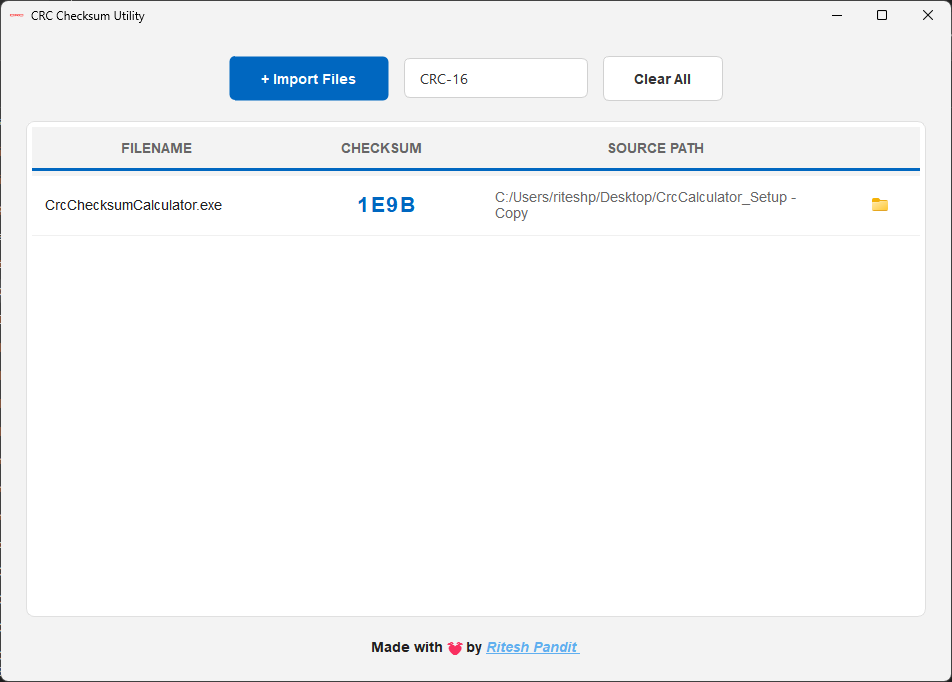

# Project is now upgraded : https://github.com/Riteshp2001/PacketForge

# CRC Checksum Calculator



## 📖 Introduction

**CRC Checksum Calculator** is a robust and user-friendly desktop application designed to compute various checksums for files. Built with **C++** and **Qt**, it provides a reliable way to verify file integrity and ensure data authenticity. Whether you are a developer, system administrator, or just need to check a file's hash, this tool offers a seamless experience with support for multiple algorithms.

## ✨ Features

-   **Multiple Algorithms**: Support for **CRC16**, **CRC32**, **MD5**, **SHA1**, and **SHA256**.
-   **Drag & Drop Support**: Easily add files by dragging them directly into the application window.
-   **Batch Processing**: Calculate checksums for multiple files simultaneously.
-   **One-Click Copy**: Click on any calculated checksum to instantly copy it to your clipboard.
-   **File Navigation**: Quickly open the source folder of any processed file.
-   **Modern UI**: A clean, responsive interface with a clear data table and intuitive controls.

## 🚀 Installation

### Prerequisites

-   **Qt 5.15** or higher
-   **C++11** compatible compiler (MinGW, MSVC, GCC)

### Build Instructions

1.  **Clone the repository:**
    ```bash
    git clone https://github.com/Riteshp2001/checksumcalculator
    cd checksumcalculator
    ```

2.  **Open the project in Qt Creator:**
    -   Launch Qt Creator.
    -   Open `CrcChecksumCalculator.pro`.

3.  **Build and Run:**
    -   Configure the project for your kit (Debug or Release).
    -   Click the **Run** button (or press `Ctrl+R`).

## 🛠️ Usage

1.  **Launch the Application**: Start the CRC Checksum Calculator.
2.  **Select Algorithm**: Choose your desired checksum algorithm (e.g., CRC32, MD5) from the dropdown menu.
3.  **Add Files**:
    -   Click the **Add Files** button to browse and select files.
    -   OR simply **Drag and Drop** files into the application window.
4.  **View Results**: The application will automatically calculate and display the checksums in the table.
5.  **Copy Checksum**: Click on a checksum value in the table to copy it to your clipboard.
6.  **Clear List**: Use the **Clear** button to remove all entries from the list.

## 📂 Project Structure

```
CrcChecksumCalculator/
├── forms/              # UI forms (*.ui)
├── headers/            # Header files (*.h)
├── images/             # Application images and assets
├── resources/          # Resource files (*.qrc, *.qss)
├── src/                # Source files (*.cpp)
├── CrcChecksumCalculator.pro  # Qt project file
└── README.md           # Project documentation
```

## 👨‍💻 Portfolio

Check out my other projects and portfolio here:
[**Ritesh Pandit**](https://riteshpandit.vercel.app)

## 📄 License

This project is licensed under the MIT License - see the [LICENSE](LICENSE) file for details.
